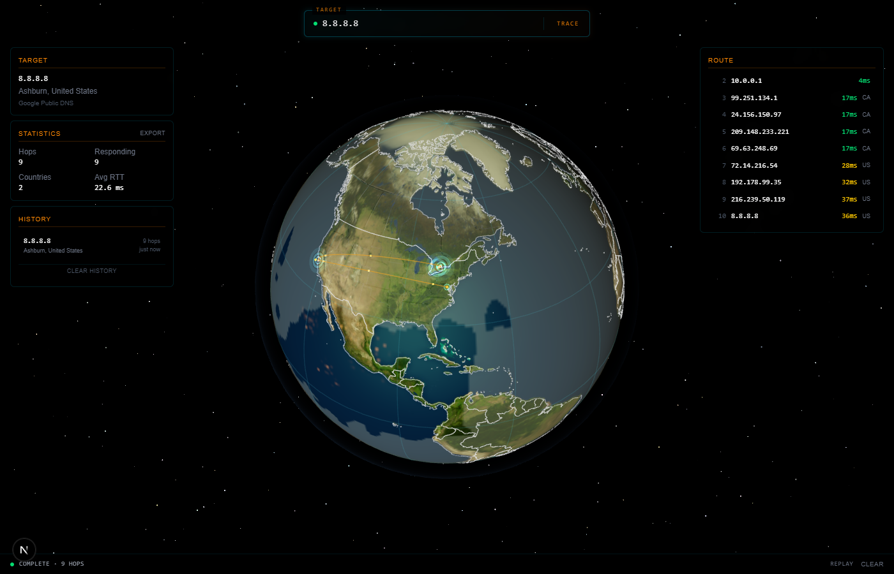
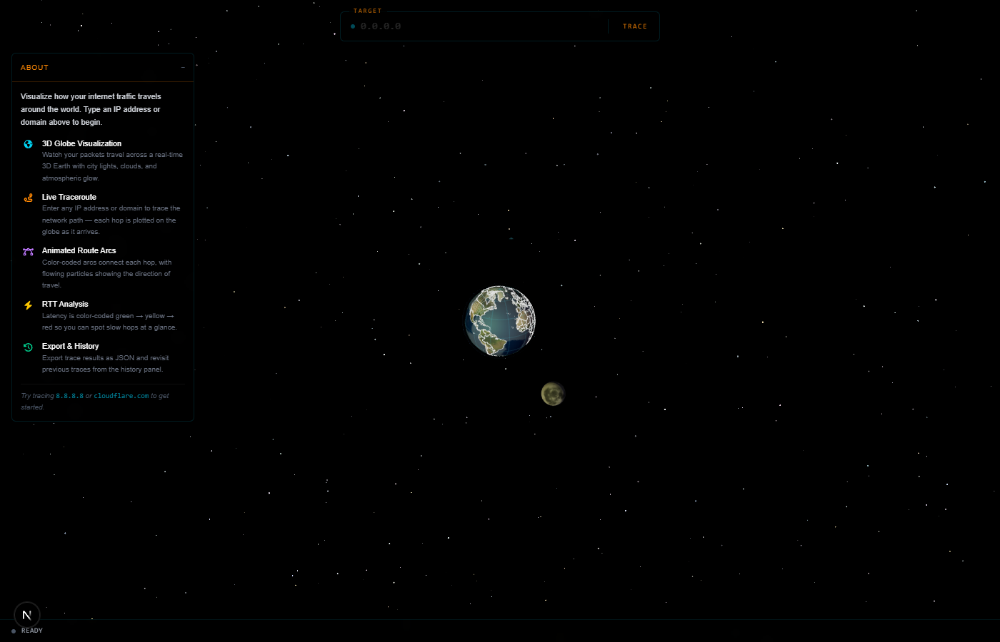
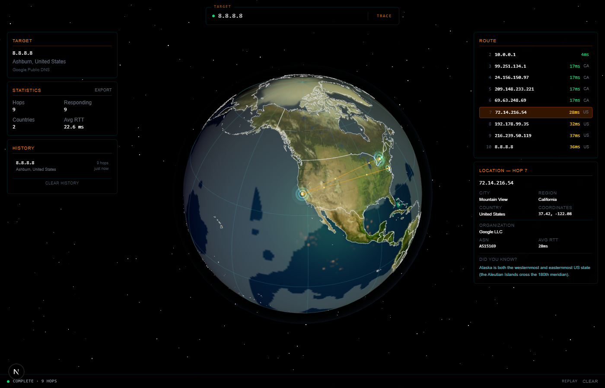

# IP Locator

A real-time 3D network route visualizer that traces packets across an interactive globe. Enter any IP address or domain and watch your traffic hop across the world.



## Features

- **3D Globe Visualization** — Procedurally rendered Earth with clouds, atmosphere, country borders, day/night cycle, and orbiting sun and moon
- **Live Traceroute** — Streams hop-by-hop results in real time using Server-Sent Events
- **Animated Route Arcs** — Color-coded arcs with flowing particles trace the path between hops
- **RTT Color Coding** — Latency is shaded green → yellow → red so slow hops stand out instantly
- **Hop Detail Panel** — Click any hop to see city, region, country, coordinates, ASN, and organization
- **Statistics & Export** — Hop count, responding hops, countries crossed, avg RTT — exportable as JSON
- **Search History** — Recent traces persisted in localStorage for quick re-access
- **Replay Mode** — Re-fly the camera along the full route after a trace completes
- **Easter Eggs** — Konami code matrix rain, shooting stars, flying saucer, comet, and more

## Screenshots

### Home View
The landing screen with the interactive 3D globe, search bar, and about panel.



### Trace Results
A completed traceroute to Google DNS (8.8.8.8) showing route arcs, hop markers, target info, statistics, and route list.


### Hop Detail
Clicking a hop reveals its full geolocation — city, region, country, coordinates, organization, and ASN.



## Tech Stack

| Layer | Technology |
|-------|-----------|
| Framework | Next.js 15 (App Router, Turbopack) |
| 3D Rendering | Three.js + React Three Fiber + Drei |
| State | Zustand |
| Styling | Tailwind CSS 4 |
| Geolocation | ipapi.co / ip-api.com (dual-source with cache) |
| Geography | TopoJSON + World Atlas |

## Getting Started

```bash
# install dependencies
npm install

# run the dev server
npm run dev
```

Open [http://localhost:3000](http://localhost:3000) and try tracing `8.8.8.8` or `cloudflare.com`.

## How It Works

1. You enter an IP address or hostname in the search bar
2. The server spawns a platform-native traceroute process (tracert on Windows, traceroute on Unix)
3. Hops stream back to the client via SSE as they arrive
4. Each hop's IP is geolocated and plotted on the 3D globe
5. Curved arcs connect consecutive hops, and the camera auto-flies to follow the route
6. On completion, target info, statistics, and full route details populate the HUD panels

## Safety & Limits

- Rate limited to 5 requests/minute per IP
- Max 10 concurrent traces
- Input validation (hostname/IP regex, 253 char max)
- Full IPv4 and IPv6 private range detection
- 60-second timeout per trace
